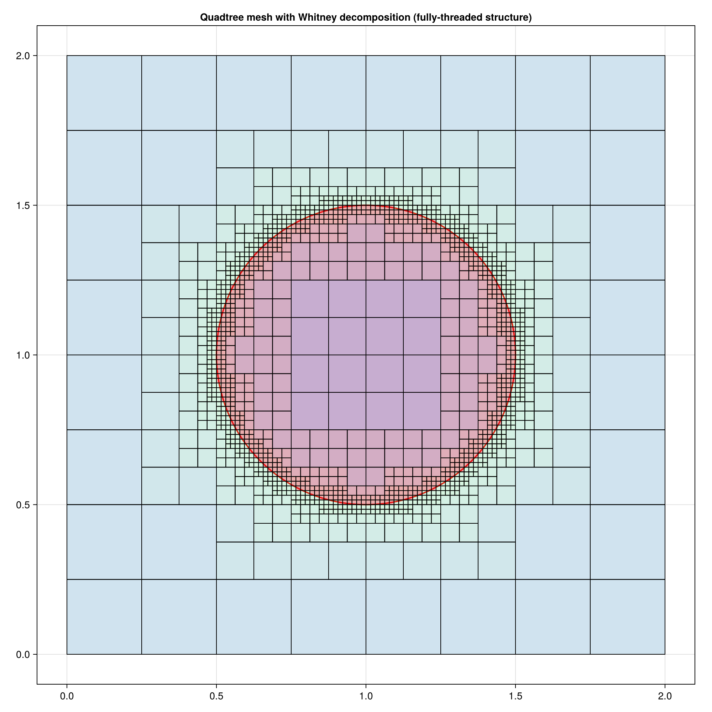
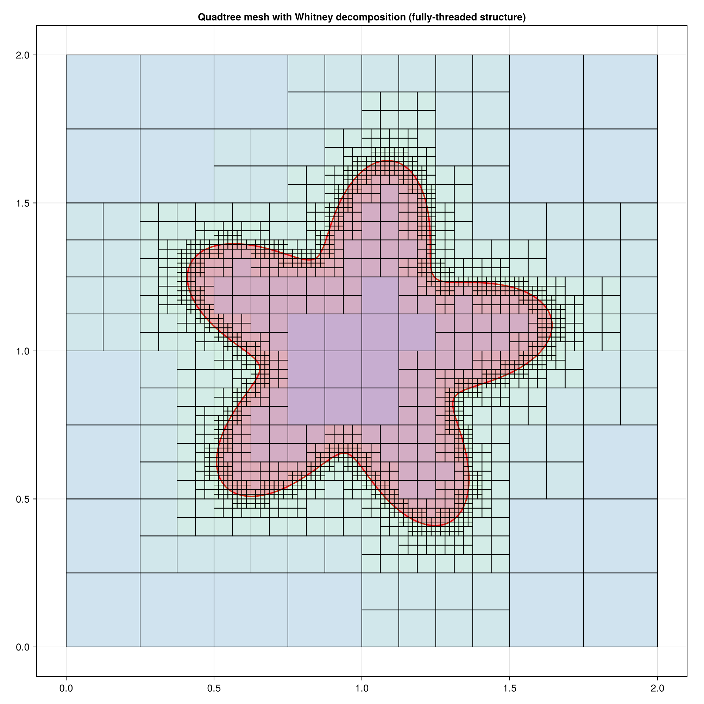

# TreeCutMesh

[](https://github.com/Fastaxx/TreeCutMesh.jl/actions/workflows/CI.yml?query=branch%3Amain)

TreeCutMesh is a Julia package for generating quadtree meshes with cut cells for interface representation. It uses a fully-threaded approach where cells maintain direct references to their neighbors for efficient computation.

## Features

- Adaptive quadtree mesh generation with Whitney refinement
- Balanced refinement (neighboring cells differ by at most one level)
- Cut cell representation for curved interfaces using level set functions
- Geometric fractions computation for fluid/solid interfaces
- Visualization tools for meshes and cut cell geometries

## Examples

### Circle Interface

The package can generate balanced quadtrees for simple geometries like circles:



```julia
using TreeCutMesh

# Define a circular interface
circle_level_set = (x, y) -> level_set_circle(x, y, 1.0, 1.0, 0.5)

# Generate balanced quadtree mesh
mesh = build_constrained_quadtree(0.0, 0.0, 2.0, 2.0, circle_level_set, max_level=6)

# Visualize
fig = visualize_quadtree(mesh, circle_level_set, (2.0, 2.0), color_by_level=true)
```

### Complex Flower Shape

The package handles more complex interfaces with high curvature regions:



```julia
# Define a flower-shaped interface
flower_level_set = (x, y) -> level_set_flower(x, y, 1.0, 1.0, 0.5, 5, 0.3)

# Generate mesh with higher refinement near the interface
mesh = build_constrained_quadtree(0.0, 0.0, 2.0, 2.0, flower_level_set, max_level=7)

# Calculate geometric fractions for cut cells
geoms = compute_geometric_fractions(get_leaf_cells(mesh), flower_level_set)

# Visualize interface with zoom
fig = visualize_interface_zoom(mesh, flower_level_set, (2.0, 2.0))
```

## Installation

```julia
using Pkg
Pkg.add(url="https://github.com/Fastaxx/TreeCutMesh.jl")
```

## Usage

```julia
using TreeCutMesh
using CairoMakie

# Create a custom level set function
my_level_set = (x, y) -> sqrt((x-1.0)^2 + (y-1.0)^2) - 0.5

# Build mesh
mesh = build_constrained_quadtree(0.0, 0.0, 2.0, 2.0, my_level_set, max_level=6)

# Get all leaf cells
leaves = get_leaf_cells(mesh)

# Compute geometric fractions
geoms = compute_geometric_fractions(leaves, my_level_set)

# Visualize
fig = visualize_geometric_fractions(mesh, my_level_set, (2.0, 2.0))
save("my_mesh.png", fig)
```

## Contributing

Contributions are welcome! Please feel free to submit a Pull Request.

## License

This project is licensed under the MIT License - see the LICENSE file for details.